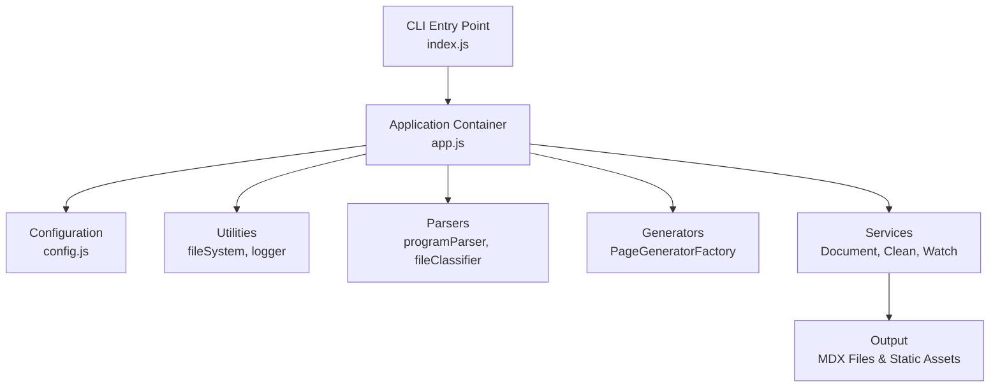
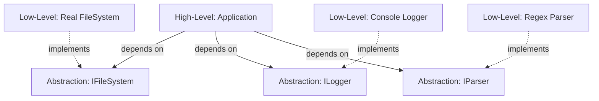
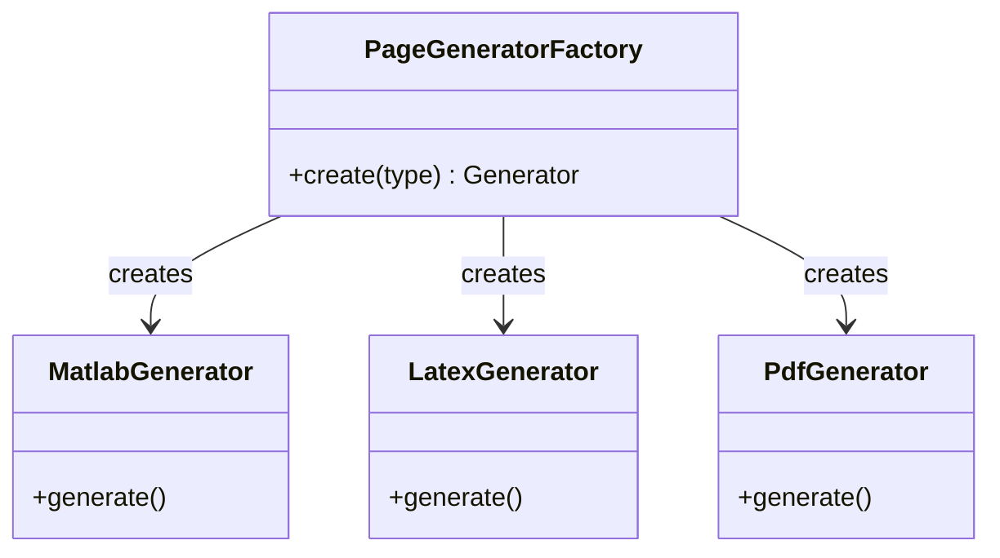

# Documentation Generator Architecture

> **A Deep Dive into SOLID Principles and Design Patterns**
>
> 📁 Located in: `scripts/` directory
>
> 🎯 Purpose: Automated documentation generation system for Applied Quantum Mechanics programs

## 📋 Table of Contents

- [Overview](#overview)
- [System Architecture](#system-architecture)
- [SOLID Principles](#solid-principles)
- [Design Patterns](#design-patterns)
- [Code Structure](#code-structure)
- [Benefits & Trade-offs](#benefits--trade-offs)

---

## Overview

The documentation generator is a sophisticated Node.js application that automatically processes multiple file formats (MATLAB, LaTeX, PDF, HTML, Jupyter Notebooks) and generates structured Docusaurus documentation pages. The system demonstrates professional software engineering principles with a focus on maintainability, testability, and extensibility.

### Key Features

- 🔄 **Multi-format Support**: MATLAB, LaTeX, PDF, HTML, Jupyter Notebooks, Text files
- 📁 **Auto-categorization**: Intelligent file grouping and organization
- 👀 **Watch Mode**: Real-time regeneration on file changes
- 🧹 **Clean Operations**: Safe removal of generated content
- ⚙️ **Configurable**: Extensible configuration system
- 🧪 **Testable**: Dependency injection enables easy testing

---

## System Architecture

### High-Level Components



### Component Hierarchy

1. **Entry Point** (`index.js:1-43`)
   - CLI argument parsing
   - Command routing
   - Application bootstrapping

2. **Application Container** (`app.js:1-220`)
   - Dependency composition
   - Service orchestration
   - Lifecycle management

3. **Configuration Layer**
   - File type definitions
   - Path configurations
   - Pattern matching rules

4. **Core Services**
   - **DocumentProcessor**: Processes INBOX files
   - **CleanService**: Removes generated files
   - **WatchService**: Monitors file changes

5. **Generators**
   - **PageGeneratorFactory**: Creates type-specific generators
   - Multiple page generators for different file types

---

## SOLID Principles

The codebase exemplifies all five SOLID principles, making it maintainable and extensible.

### 🎯 1. Single Responsibility Principle (SRP)

> *"A class should have one, and only one, reason to change."*

#### Implementation Examples

**✅ Each module has ONE responsibility:**

```javascript title="app.js:7-10"
// Each factory creates ONE type of object
const { createFileSystem } = require('./utils/fileSystem');
const { createLogger, createNullLogger } = require('./utils/logger');
const { createProgramParser } = require('./parsers/programParser');
```

**Responsibility Segregation:**

| Module | Single Responsibility | Location |
|--------|----------------------|----------|
| `index.js` | CLI argument parsing & routing | `index.js:1-43` |
| `app.js` | Application composition | `app.js:24-215` |
| `createFileSystem` | File I/O operations | Utilities |
| `createLogger` | Logging operations | Utilities |
| `createProgramParser` | Filename parsing | Parsers |
| `PageGeneratorFactory` | Page generator creation | Generators |
| `DocumentProcessor` | Document processing workflow | Services |
| `CleanService` | File cleanup operations | Services |
| `WatchService` | File watching & auto-regeneration | Services |

**Code Evidence:**

```javascript title="app.js:49-56"
const documentProcessor = createDocumentProcessor({
  fileSystem,           // Handles file I/O
  programParser,        // Parses filenames
  fileClassifier,       // Classifies file types
  generatorFactory,     // Creates generators
  config,              // Provides configuration
});
```

Each dependency has a **single, well-defined purpose**.

---

### 🔓 2. Open/Closed Principle (OCP)

> *"Software entities should be open for extension but closed for modification."*

#### Implementation Examples

**✅ Extension without modification:**

**1. File Type Extension**

```javascript title="generate-program-docs.js:35-89"
// Adding a new file type requires NO changes to core logic
const FILE_TYPES = {
  '.m': { type: 'matlab', label: 'MATLAB', emoji: '📊', ... },
  '.tex': { type: 'latex', label: 'LaTeX', emoji: '📝', ... },
  '.pdf': { type: 'pdf', label: 'PDF Document', emoji: '📕', ... },
  // Add new type here - no code changes needed!
  '.py': { type: 'python', label: 'Python', emoji: '🐍', ... },
};
```

**2. Generator Factory Pattern**

```javascript title="app.js:41-46"
// PageGeneratorFactory can create new generators
// without modifying existing generator code
const generatorFactory = new PageGeneratorFactory({
  viewerBaseUrl: config.VIEWER_BASE_URL,
  githubRawBase: config.GITHUB_RAW_BASE,
  nbviewerBaseUrl: config.NBVIEWER_BASE_URL,
});
```

**3. Configuration-Driven Behavior**

```javascript title="generate-program-docs.js:605-622"
// Switch statement delegates to specialized generators
// New generators can be added without modifying this function
function generateDetailPage(programInfo, filename, staticPath, fileContent, config) {
  switch (config.type) {
    case 'matlab': return generateMatlabPage(...);
    case 'latex': return generateLatexPage(...);
    case 'pdf': return generatePdfPage(...);
    case 'html': return generateHtmlPage(...);
    case 'ipynb': return generateNotebookPage(...);
    case 'text': return generateTextPage(...);
    default: return null;
  }
}
```

**Benefits:**
- ✅ Add new file formats without changing processing logic
- ✅ Add new generators without modifying factory
- ✅ Extend configuration without code changes

---

### 🔄 3. Liskov Substitution Principle (LSP)

> *"Objects should be replaceable with instances of their subtypes without altering program correctness."*

#### Implementation Examples

**✅ Substitutable implementations:**

**1. Logger Substitution**

```javascript title="app.js:30-32"
// Real logger and null logger are interchangeable
const logger = options.silent
  ? createNullLogger()      // Silent implementation
  : createLogger(options.logger || {});  // Verbose implementation
```

Both implement the same interface:
- `logger.header(msg)`
- `logger.log(msg)`
- `logger.fail(msg)`
- `logger.printStats(stats)`

**2. Dependency Injection Pattern**

```javascript title="app.js:29-46"
// All dependencies can be substituted with mock/test implementations
const fileSystem = options.fileSystem || createFileSystem();
const programParser = options.programParser || createProgramParser(...);
const fileClassifier = options.fileClassifier || createFileClassifier(...);
const generatorFactory = options.generatorFactory || new PageGeneratorFactory(...);
```

**Testing Example:**

```javascript
// Production code
const app = createApplication({
  fileSystem: createFileSystem()  // Real file system
});

// Test code
const app = createApplication({
  fileSystem: createMockFileSystem()  // Mock file system
});
// Application works identically with both!
```

**Benefits:**
- ✅ Easy unit testing with mocks
- ✅ Multiple implementations (production, testing, debugging)
- ✅ No changes to consuming code

---

### 🧩 4. Interface Segregation Principle (ISP)

> *"Clients should not be forced to depend on interfaces they don't use."*

#### Implementation Examples

**✅ Focused, minimal interfaces:**

**1. Service Dependencies**

```javascript title="app.js:49-70"
// DocumentProcessor only depends on what it needs
const documentProcessor = createDocumentProcessor({
  fileSystem,        // Only file operations
  programParser,     // Only parsing
  fileClassifier,    // Only classification
  generatorFactory,  // Only generation
  config,           // Only configuration
});

// CleanService has minimal dependencies
const cleanService = createCleanService({
  fileSystem,  // Only needs file operations
  config,      // Only needs paths
  logger,      // Only needs logging
});

// WatchService only gets what it needs
const watchService = createWatchService({
  fileSystem,
  config,
  documentProcessor,
  sidebarGenerator,
  logger,
});
```

**2. Function Parameters**

```javascript title="generate-program-docs.js:166-292"
// generateIndexPage only receives what it needs
function generateIndexPage(programInfo, filesList) {
  // Not passed entire config, file system, or other unrelated data
  const { programId, displayName, chapterNum } = programInfo;
  // ...
}

// generateMatlabPage has focused parameters
function generateMatlabPage(programInfo, filename, staticPath, fileContent, config) {
  // Only file-specific data, no global state
}
```

**Benefits:**
- ✅ Functions only depend on what they use
- ✅ Easier to understand and test
- ✅ Reduced coupling
- ✅ Clear contracts

---

### ⬇️ 5. Dependency Inversion Principle (DIP)

> *"Depend on abstractions, not concretions."*

#### Implementation Examples

**✅ High-level modules independent of low-level details:**

**1. Application Container**

```javascript title="app.js:24-91"
function createApplication(options = {}) {
  // High-level application logic depends on abstractions (options)
  // not concrete implementations

  const fileSystem = options.fileSystem || createFileSystem();
  const logger = options.silent ? createNullLogger() : createLogger(...);
  const programParser = options.programParser || createProgramParser(...);

  // Services depend on injected abstractions
  const documentProcessor = createDocumentProcessor({
    fileSystem,      // Abstraction
    programParser,   // Abstraction
    fileClassifier,  // Abstraction
    generatorFactory,// Abstraction
    config,         // Abstraction
  });

  return {
    run() { /* Uses injected dependencies */ },
    watch() { /* Uses injected dependencies */ },
    clean() { /* Uses injected dependencies */ },
  };
}
```

**2. Inversion of Control**



**Traditional Approach (BAD):**
```javascript
// High-level directly depends on low-level
class Application {
  constructor() {
    this.fs = require('fs');  // Concrete dependency!
    this.logger = console;    // Concrete dependency!
  }
}
```

**DIP Approach (GOOD):**
```javascript
// High-level depends on abstraction
function createApplication(options = {}) {
  const fileSystem = options.fileSystem || createFileSystem();
  const logger = options.logger || createLogger();
  // Abstractions injected, not hardcoded!
}
```

**Benefits:**
- ✅ Easy to swap implementations
- ✅ Testable with mocks
- ✅ Flexible and maintainable
- ✅ Decoupled modules

---

## Design Patterns

The codebase implements multiple classic design patterns to achieve flexibility and maintainability.

### 🏭 1. Factory Pattern

**Intent:** Create objects without specifying their exact class.

#### Implementation

**PageGeneratorFactory**

```javascript title="app.js:41-46"
const generatorFactory = new PageGeneratorFactory({
  viewerBaseUrl: config.VIEWER_BASE_URL,
  githubRawBase: config.GITHUB_RAW_BASE,
  nbviewerBaseUrl: config.NBVIEWER_BASE_URL,
});

// Factory creates appropriate generator based on file type
const generator = generatorFactory.create(fileType);
```

**Factory Functions**

```javascript title="app.js:7-17"
const { createFileSystem } = require('./utils/fileSystem');
const { createLogger, createNullLogger } = require('./utils/logger');
const { createProgramParser } = require('./parsers/programParser');
const { createFileClassifier } = require('./parsers/fileClassifier');
const { createDocumentProcessor } = require('./services');
```

#### Benefits

- ✅ Encapsulates object creation logic
- ✅ Supports multiple implementations
- ✅ Easier to add new types
- ✅ Centralized configuration

**UML Diagram:**



---

### 💉 2. Dependency Injection Pattern

**Intent:** Inject dependencies rather than creating them internally.

#### Implementation

```javascript title="app.js:24-91"
function createApplication(options = {}) {
  // All dependencies are injected or provided with defaults
  const config = createConfig(options.config || {});
  const fileSystem = options.fileSystem || createFileSystem();
  const logger = options.silent ? createNullLogger() : createLogger();
  const programParser = options.programParser || createProgramParser(...);

  // Dependencies passed to services
  const documentProcessor = createDocumentProcessor({
    fileSystem,
    programParser,
    fileClassifier,
    generatorFactory,
    config,
  });

  return { /* API using injected dependencies */ };
}
```

#### Benefits

- ✅ **Testability**: Inject mocks for testing
- ✅ **Flexibility**: Swap implementations easily
- ✅ **Decoupling**: Components don't create their own dependencies
- ✅ **Configuration**: Override defaults when needed

**Example: Testing**

```javascript
// Production
const app = createApplication();

// Testing
const app = createApplication({
  fileSystem: mockFileSystem,
  logger: mockLogger,
  config: testConfig
});
```

---

### 🎯 3. Strategy Pattern

**Intent:** Define a family of algorithms, encapsulate each one, and make them interchangeable.

#### Implementation

**File Type Strategies**

```javascript title="generate-program-docs.js:605-622"
// Different strategies for different file types
function generateDetailPage(programInfo, filename, staticPath, fileContent, config) {
  switch (config.type) {
    case 'matlab':
      return generateMatlabPage(programInfo, filename, staticPath, fileContent, config);
    case 'latex':
      return generateLatexPage(programInfo, filename, staticPath, fileContent, config);
    case 'pdf':
      return generatePdfPage(programInfo, filename, staticPath, config);
    case 'html':
      return generateHtmlPage(programInfo, filename, staticPath, fileContent, config);
    case 'ipynb':
      return generateNotebookPage(programInfo, filename, staticPath, config);
    case 'text':
      return generateTextPage(programInfo, filename, staticPath, fileContent, config);
    default:
      return null;
  }
}
```

**File Type Configuration as Strategy**

```javascript title="generate-program-docs.js:36-89"
const FILE_TYPES = {
  '.m': {
    type: 'matlab',
    canReadText: true,        // Strategy: Read as text
    codeLanguage: 'matlab',
  },
  '.pdf': {
    type: 'pdf',
    canReadText: false,       // Strategy: Use iframe
    useIframe: true,
    iframeHeight: '900px',
  },
  '.ipynb': {
    type: 'ipynb',
    canReadText: false,       // Strategy: External viewer
    useIframe: false,
  },
};
```

#### Benefits

- ✅ Add new strategies without modifying existing code
- ✅ Encapsulate algorithm details
- ✅ Runtime strategy selection
- ✅ Cleaner conditionals

---

### 📝 4. Template Method Pattern

**Intent:** Define the skeleton of an algorithm, letting subclasses override specific steps.

#### Implementation

**Page Generation Template**

```javascript title="generate-program-docs.js:297-338"
// Template structure for all page types
function generateMatlabPage(programInfo, filename, staticPath, fileContent, config) {
  const { displayName } = programInfo;

  // Step 1: Build viewer section (customizable)
  let viewerSection = '';
  if (CONFIG.VIEWER_BASE_URL) {
    viewerSection = `/* viewer HTML */`;
  }

  // Step 2: Return structured page (template)
  return `---
title: ${escapeForYaml(`${displayName} - MATLAB`)}
sidebar_label: MATLAB Code
---

# ${displayName} - MATLAB Code

<div style={{...}}>
${viewerSection}
  <a href="${staticPath}" download="${filename}">📥 Download</a>
  <a href="${staticPath}" target="_blank">🔗 Open Raw</a>
</div>

## Source Code

\`\`\`matlab title="${filename}"
${fileContent || '% Unable to read file'}
\`\`\`

---

[← Back to ${displayName}](./)
`;
}
```

All page generators follow the same template:
1. **Frontmatter** (title, sidebar_label)
2. **Header** (title, description)
3. **Action buttons** (download, open, view)
4. **Content section** (code/iframe/preview)
5. **Footer** (back link)

#### Benefits

- ✅ Consistent structure across all pages
- ✅ Reusable template logic
- ✅ Customizable steps
- ✅ DRY (Don't Repeat Yourself)

---

### 👀 5. Observer Pattern

**Intent:** Define a one-to-many dependency so that when one object changes state, dependents are notified.

#### Implementation

**File System Watcher**

```javascript title="generate-program-docs.js:912-951"
function watchMode() {
  console.log(`\n👀 Watch Mode: Monitoring INBOX for changes...\n`);

  // Initial run
  processAllPrograms();

  // Observer: Watch for file system changes
  const watcher = fs.watch(CONFIG.INBOX_DIR, (eventType, filename) => {
    if (!filename) return;

    const ext = path.extname(filename).toLowerCase();
    if (CONFIG.SUPPORTED_EXTENSIONS.includes(ext)) {
      console.log(`📄 Change: ${filename}`);
      debouncedProcess();  // Notify observers
    }
  });

  // Cleanup on termination
  process.on('SIGINT', () => {
    console.log('\n\n👋 Stopping watch mode...');
    watcher.close();
    process.exit(0);
  });
}
```

**Debounce Pattern (Observer Enhancement)**

```javascript title="generate-program-docs.js:148-158"
// Prevents multiple rapid notifications
function debounce(func, wait) {
  let timeout;
  return function executedFunction(...args) {
    const later = () => {
      clearTimeout(timeout);
      func(...args);
    };
    clearTimeout(timeout);
    timeout = setTimeout(later, wait);
  };
}
```

#### Benefits

- ✅ Automatic regeneration on file changes
- ✅ Decoupled file watching from processing
- ✅ Scalable (can add multiple observers)
- ✅ Real-time updates

---

### 🎨 6. Builder Pattern (Implicit)

**Intent:** Separate the construction of complex objects from their representation.

#### Implementation

**MDX Page Building**

```javascript title="generate-program-docs.js:174-238"
// Step-by-step construction of file cards
const fileCards = filesList.map(({ filename, fileType, staticPath, config }) => {
  const detailPageLink = `./${programId}_${config.type}`;

  // Build card HTML step by step
  return `
<div style={{...}}>
  <div style={{...}}>
    <span style={{...}}>${config.emoji}</span>
    <div>
      <strong style={{...}}>${config.label}</strong>
      <div style={{...}}>\`${filename}\`</div>
    </div>
  </div>
  <div style={{...}}>
    <a href="${detailPageLink}" style={{...}}>📖 View Details</a>
    <a href="${staticPath}" download="${filename}" style={{...}}>📥 Download</a>
    <a href="${staticPath}" target="_blank" style={{...}}>🔗 Open</a>
  </div>
</div>`;
}).join('\n');
```

**Configuration Building**

```javascript title="generate-program-docs.js:4-33"
// Build configuration object step by step
const CONFIG = {
  INBOX_DIR: path.join(__dirname, '../INBOX'),
  DOCS_OUTPUT_DIR: path.join(__dirname, '../docs'),
  STATIC_OUTPUT_DIR: path.join(__dirname, '../static/programs'),
  PROGRAM_PATTERN: /^Chapt(\d+)(Exercise|Fig)(\d+)([a-z]\d*)?$/i,
  SUPPORTED_EXTENSIONS: ['.m', '.tex', '.ipynb', '.pdf', '.html', '.txt'],
  VIEWER_BASE_URL: null,
  NBVIEWER_BASE_URL: 'https://nbviewer.org/urls',
  GITHUB_RAW_BASE: null,
};
```

---

## Code Structure

### File Organization

```
scripts/
├── index.js                 # CLI entry point
├── app.js                   # Application container (DI)
├── generate-program-docs.js # Monolithic implementation
├── config/
│   └── index.js            # Configuration management
├── utils/
│   ├── fileSystem.js       # File I/O abstraction
│   └── logger.js           # Logging abstraction
├── parsers/
│   ├── programParser.js    # Filename parsing
│   └── fileClassifier.js   # File type classification
├── generators/
│   ├── index.js
│   ├── PageGeneratorFactory.js
│   ├── MatlabGenerator.js
│   ├── LatexGenerator.js
│   └── ...
└── services/
    ├── DocumentProcessor.js  # Main processing
    ├── CleanService.js       # Cleanup operations
    └── WatchService.js       # File watching
```

### Separation of Concerns

| Layer | Responsibility | Files |
|-------|---------------|-------|
| **Entry** | CLI & routing | `index.js` |
| **Application** | Composition & lifecycle | `app.js` |
| **Configuration** | Settings & constants | `config/` |
| **Utilities** | Cross-cutting concerns | `utils/` |
| **Parsers** | Data extraction | `parsers/` |
| **Generators** | Content generation | `generators/` |
| **Services** | Business logic | `services/` |

---

## Benefits & Trade-offs

### ✅ Benefits

#### 1. **Maintainability**
- Clear separation of concerns
- Easy to locate and fix bugs
- Self-documenting code structure

#### 2. **Testability**
- All dependencies injectable
- Mockable interfaces
- Isolated unit testing

#### 3. **Extensibility**
- Add new file types without changing core logic
- New generators plug in easily
- Configuration-driven behavior

#### 4. **Flexibility**
- Multiple implementations (production, testing, mocking)
- Runtime configuration
- Feature toggles

#### 5. **Reusability**
- Modular components
- Factory functions
- Shared utilities

### ⚠️ Trade-offs

#### 1. **Complexity**
- More files and abstractions
- Steeper learning curve
- Indirection overhead

```javascript
// Before (simple, direct)
const fs = require('fs');
fs.readFileSync('file.txt');

// After (flexible, testable)
const fileSystem = options.fileSystem || createFileSystem();
fileSystem.readFile('file.txt');
```

#### 2. **Initial Development Time**
- More upfront design
- Interface definitions
- Dependency wiring

#### 3. **Performance**
- Minimal overhead from abstractions
- Factory creation costs
- (Usually negligible in practice)

### 🎯 When to Use These Patterns

| Use Case | Pattern | Reason |
|----------|---------|--------|
| Multiple file formats | Strategy + Factory | Different handling per type |
| Testing required | Dependency Injection | Mock dependencies |
| Extensible system | Open/Closed Principle | Add features without changes |
| Complex object creation | Factory | Centralize creation logic |
| File monitoring | Observer | React to changes |
| Template pages | Template Method | Consistent structure |

---

## Practical Examples

### Adding a New File Type

**Before (Requires code changes everywhere):**
```javascript
// Have to modify multiple functions
function processFile(file) {
  if (file.endsWith('.m')) { /* ... */ }
  else if (file.endsWith('.tex')) { /* ... */ }
  else if (file.endsWith('.pdf')) { /* ... */ }
  // Add new condition here for .py files
}
```

**After (Configuration-driven, OCP):**
```javascript
// 1. Add configuration only
const FILE_TYPES = {
  '.py': {
    type: 'python',
    label: 'Python',
    emoji: '🐍',
    canReadText: true,
    codeLanguage: 'python',
  },
};

// 2. Add generator (new file)
function generatePythonPage(programInfo, filename, staticPath, fileContent, config) {
  // Implementation
}

// 3. Register in factory (one line)
case 'python':
  return generatePythonPage(programInfo, filename, staticPath, fileContent, config);
```

**No changes to:**
- File scanning logic
- Processing workflow
- CLI interface
- Logging system
- Testing infrastructure

---

### Testing with Dependency Injection

```javascript
// Production code
const app = createApplication();
app.run();

// Unit test
const mockFileSystem = {
  existsSync: jest.fn(() => true),
  readdirSync: jest.fn(() => ['Chapt1Exercise1.m']),
  readFileSync: jest.fn(() => '% MATLAB code'),
  writeFileSync: jest.fn(),
};

const mockLogger = {
  log: jest.fn(),
  header: jest.fn(),
  fail: jest.fn(),
};

const app = createApplication({
  fileSystem: mockFileSystem,
  logger: mockLogger,
  silent: false,
});

const stats = app.run();

expect(mockFileSystem.readdirSync).toHaveBeenCalled();
expect(mockLogger.log).toHaveBeenCalled();
expect(stats.processed).toBe(1);
```

---

## Conclusion

This documentation generator demonstrates professional software engineering practices:

- ✅ **All 5 SOLID Principles** implemented
- ✅ **6 Design Patterns** used effectively
- ✅ **Clean Architecture** with clear layers
- ✅ **High Testability** through DI
- ✅ **Easy Extensibility** for new features

### Key Takeaways

1. **SOLID principles** aren't theoretical - they solve real problems
2. **Design patterns** emerge naturally when solving actual challenges
3. **Dependency Injection** is the foundation of testable code
4. **Factory Pattern** enables extensibility
5. **Configuration-driven** design reduces code changes

### Further Reading

- [SOLID Principles Explained](https://en.wikipedia.org/wiki/SOLID)
- [Design Patterns: Elements of Reusable Object-Oriented Software](https://en.wikipedia.org/wiki/Design_Patterns)
- [Dependency Injection in JavaScript](https://www.martinfowler.com/articles/injection.html)
- [Clean Code by Robert C. Martin](https://www.amazon.com/Clean-Code-Handbook-Software-Craftsmanship/dp/0132350882)

---

**Documentation Version:** 1.0
**Last Updated:** December 23, 2025
**Author:** Documentation Generator Team
